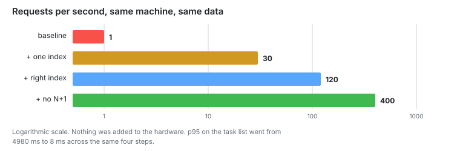
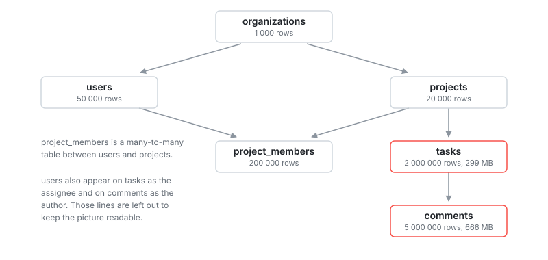

# ts-api-scaling-lab

[](https://github.com/Biplo12/ts-api-scaling-lab/actions/workflows/ci.yml)

I built a REST API on Postgres and wrote it the simple way. Then I made it faster
in eight steps. I measured after every step.

It started at 1 request per second. It ended at 2600. Same desktop.



## Where it stands

| Stage | Change                             | Capacity | p95 there | p99 at 2000 asked |
| ----- | ---------------------------------- | -------- | --------- | ----------------- |
| 1     | nothing, baseline                  | 1 RPS    | 4980 ms   |                   |
| 2     | one index on comments.task_id      | 30 RPS   | 235 ms    |                   |
| 3     | the right composite index on tasks | 120 RPS  | 197 ms    |                   |
| 4     | joins instead of N+1               | 400 RPS  | 8.2 ms    |                   |
| 5     | Node on 4 processes instead of 1   | 1200 RPS | 46 ms     | 1230 ms           |
| 6     | timeouts and load shedding         | 1200 RPS | 46 ms     | 209 ms            |
| 7     | prepared statements, schemas       | 2000 RPS | 57 ms     | 93 ms             |
| 8     | Redis cache with singleflight      | 2600 RPS | 55 ms     | 65 ms             |

Capacity means the highest rate the server kept up with.

Stage 6 has the same capacity as stage 5. It did not add throughput. It put a cap
on latency above capacity, so only the last column changes.

I never changed the hardware.

## Contents

- [Stage notes](#stage-notes)
- [Why the first version was slow](#why-the-first-version-was-slow)
- [The database](#the-database)
- [Endpoints](#endpoints)
- [Machine and stack](#machine-and-stack)
- [Run it](#run-it)
- [Measure it](#measure-it)

## Stage notes

| File                                                        | What is in it                       |
| ----------------------------------------------------------- | ----------------------------------- |
| [00-starting-point.md](docs/00-starting-point.md)           | What I decided before writing code  |
| [01-baseline.md](docs/01-baseline.md)                       | The slow version, and how I measure |
| [02-indexes.md](docs/02-indexes.md)                         | One index, 30 times the capacity    |
| [03-index-choice.md](docs/03-index-choice.md)               | Four indexes for one query          |
| [04-n-plus-one.md](docs/04-n-plus-one.md)                   | 42 queries down to 3                |
| [05-cluster.md](docs/05-cluster.md)                         | Four processes beat six             |
| [06-overload.md](docs/06-overload.md)                       | Saying no instead of queueing       |
| [07-cost-of-abstraction.md](docs/07-cost-of-abstraction.md) | Where the CPU goes                  |
| [08-cache.md](docs/08-cache.md)                             | Cache, and why TTL did not matter   |

Every file has the same five parts. The problem, the change, the numbers, some
notes, what came next.

## Why the first version was slow

I did not break anything on purpose. Three normal mistakes:

- Queries written the way ORM docs show them. One call per related row.
- No indexes on foreign keys.
- Default Postgres config.

Every version is in git.

## The database

A small SaaS for tracking work. Organizations own users and projects. Projects
hold tasks. Tasks hold comments.



1003 MB on disk and 7.3 million rows. The seeder uses a fixed random seed, so two
runs give the same database.

The data is uneven on purpose. The biggest organization has 209 879 tasks. The
middle one has 1088. The smallest has 279. If every organization had the same
size, the cache numbers in stage 8 would mean nothing.

## Endpoints

| Method | Path                | Queries |
| ------ | ------------------- | ------- |
| GET    | /health             | 0       |
| GET    | /tasks/:id          | 2       |
| GET    | /projects/:id/tasks | 3       |
| POST   | /tasks/:id/comments | 4       |
| GET    | /metrics            | 0       |

The two read endpoints ran 15 and 42 queries before stage 4.

`/health` returns a constant. It is there to measure the test setup itself. It
never gets shed, and neither does `/metrics`.

The load test sends 60 percent task lists, 30 percent task details and 10 percent
writes. A write reads the task first, so `/tasks/:id` gets 40 percent of all
requests.

## Machine and stack

A desktop. Intel Core, 6 cores and 12 threads, 2.6 GHz base and 4.4 GHz boost,
32 GB RAM, NVMe disk.

Node 24, TypeScript 6, Fastify 5, Postgres 18, Drizzle 0.45, pg 8, Redis 8,
ioredis, prom-client, k6.

Node runs on Windows. Postgres and Redis run in Docker. k6 runs on the same
machine and takes CPU away from the server. So these numbers compare the steps
against each other. They do not say what this hardware can do with a separate
client. Stage 1 measures how much k6 costs.

## Run it

```bash
docker compose up -d
```

```bash
yarn install
```

```bash
cp .env.example .env
```

```bash
yarn db:migrate
```

The seeder writes 7.3 million rows. It takes about five minutes:

```bash
yarn db:seed
```

```bash
yarn dev
```

## Measure it

Build first, then start the server with logging off:

```bash
yarn build
```

```bash
yarn start:bench
```

In a second terminal, measure the test setup:

```bash
yarn bench:ceiling
```

Then send real traffic:

```bash
k6 run -e RATE=100 -e DURATION=30s bench/load.js
```

Start low and go up. Wait a moment between runs. Stage 3 shows what happens if
you do not.

Use `127.0.0.1` and not `localhost`. Stage 1 explains why.

`.env` has the switches: `WORKERS`, `MAX_INFLIGHT`, `SHEDDING`, `CACHE`,
`SINGLEFLIGHT`, `CACHE_TTL_S`. Turn any of them off and you get the measurement
from before that step.

### While a test runs

```bash
curl -s http://127.0.0.1:3000/metrics | grep -E "eventloop_lag_mean|pg_pool|cache_"
```

PowerShell needs `curl.exe` and `Select-String`:

```bash
curl.exe -s http://127.0.0.1:3000/metrics | Select-String "eventloop_lag_mean|pg_pool|cache_"
```

If event loop lag is going up, Node has run out of CPU. If
`pg_pool_waiting_requests` is above zero, requests are waiting for a database
connection. If both look fine and latency is still high, the database is slow.

## License

MIT, see [LICENSE](LICENSE).
