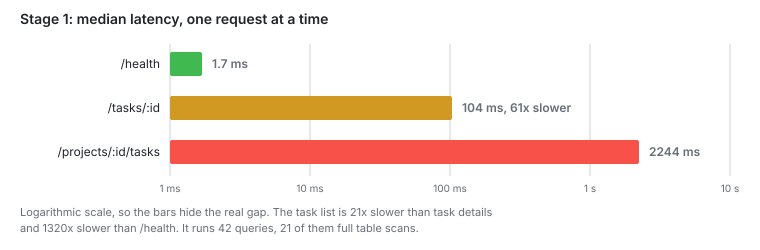

# Stage 1: Baseline

I measured everything before changing anything.

**Capacity: 1 RPS.** At that rate the task list had a p95 of 4980 ms.

## The problem

None yet. This file is the reference for every later number. It also sets out how
I measure.

## The change

None.

## Numbers

`/health` returns a constant and never opens a database connection. So this table
is the limit of the test setup, k6 included:

| Asked for | Delivered | p95      | Failed |
| --------- | --------- | -------- | ------ |
| 2000      | 2000      | ~0 ms    | 0%     |
| 10 000    | 10 000    | ~0 ms    | 0%     |
| 15 000    | 14 870    | 19.7 ms  | 0%     |
| 20 000    | 18 132    | 127.8 ms | 2.94%  |

One request at a time, median of 15 runs. Every median in this project is
measured the same way:

| Endpoint             | Median  | Queries |
| -------------------- | ------- | ------- |
| /health              | 1.7 ms  | 0       |
| /tasks/:id           | 104 ms  | 15      |
| /projects/4200/tasks | 2244 ms | 42      |

Under load, still on one process:

| Asked for | Task list median | p95       | Kept up            |
| --------- | ---------------- | --------- | ------------------ |
| 1 RPS     | 3510 ms          | 4980 ms   | yes                |
| 2 RPS     | 20 380 ms        | 25 330 ms | no, delivered 1.26 |

## Notes

Fastify is not the limit here. 14 870 against 1. The gap is all queries.

One task list takes 2244 ms on its own. At one request per second the median is
3510 ms. So one request per second is enough to make them wait for each other.

Nothing fails. Things just get slower. At 2 RPS there were zero HTTP errors and
p99 was 25.8 seconds. There are no timeouts and no limits anywhere in the code.
Every stage up to 6 behaves like this.

`localhost` cost 206 ms per request. `/health` took 208 ms through the name and
1.8 ms through `127.0.0.1`. Windows tries IPv6 first and the server listens on
IPv4, so every request waited for that to fail. I took all the numbers above
after fixing this.

I ran the same `EXPLAIN ANALYZE` twice and got 62 ms and 87 ms. That is why every
number here is a median of several runs.

The metrics endpoint costs about 200 microseconds per request at 10 000 RPS. I
measured that before and after adding it. At 15 000 the same comparison gave
averages between 17 ms and 132 ms across three runs. So 15 000 is the limit of the
test setup, but it is not a rate this machine reports the same way twice. When the
exact number matters I stay at 10 000 or below.

## Next

The task list runs one count per task over the comments table. Twenty counts. That
table has no index on `task_id`.
