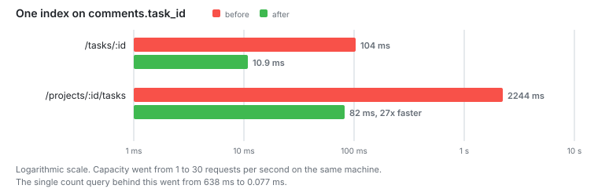

# Stage 2: First index

One index, on `comments.task_id`.

**Capacity: 1 RPS to 30 RPS.**



## The problem

The task list runs one count per task over the comments table. That is 20 counts.
Each one reads the whole table, 559 MB of it.

## The change

```ts
(t) => [index('comments_task_id_idx').on(t.taskId)];
```

It took three seconds to build and takes 65 MB.

## Numbers

Counting comments for one task:

|                 | Before            | After           |
| --------------- | ----------------- | --------------- |
| Plan            | Parallel Seq Scan | Index Only Scan |
| Rows scanned    | 5 000 000         | 3               |
| Read from disk  | 435 MB            | 56 kB           |
| Read from cache | 124 MB            | 32 kB           |
| Time            | 638 ms            | 0.077 ms        |

Endpoints:

| Endpoint             | Before  | After   |
| -------------------- | ------- | ------- |
| /tasks/:id           | 104 ms  | 10.9 ms |
| /projects/4200/tasks | 2244 ms | 82 ms   |

Under load:

| Asked for | Task list median | p95     | Kept up          |
| --------- | ---------------- | ------- | ---------------- |
| 20 RPS    | 88 ms            | 127 ms  | yes              |
| 30 RPS    | 132 ms           | 235 ms  | yes              |
| 40 RPS    | 1210 ms          | 5330 ms | no, delivered 36 |

## Notes

Thirty times the capacity from one index. I did not change anything else.

The new plan says `Heap Fetches: 0`. Postgres answers the count from the index and
never opens the table. That works because the query only needs `task_id`. If it
needed any other column, Postgres would have to fetch the rows too.

At 40 RPS there are still no HTTP errors. The requests that went missing were
dropped by k6 after waiting. The server did not refuse them.

The task list is down to 82 ms. It still runs 42 queries for one page.

Plans: [before](stage2/before-count-comments.txt),
[after](stage2/after-count-comments.txt)

## Next

Those 42 queries look like the obvious thing to fix. The plan says something else.
