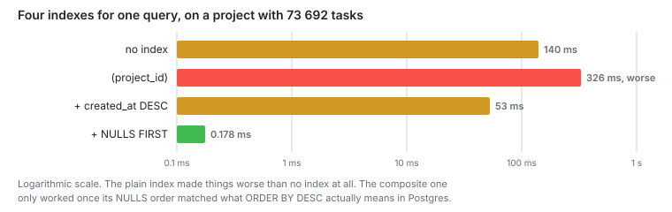

# Stage 3: Choosing the index

I indexed `tasks.project_id`. It took four tries.

**Capacity: 30 RPS to 120 RPS.**



## The problem

I expected the 42 queries to be the bottleneck. The plan for the task list said
otherwise:

```
Parallel Seq Scan on tasks   62 ms
Rows Removed by Filter:      666 636 x 3 workers
Execution Time:              66.8 ms
```

One query out of 42 was most of the 82 ms. The other 41 together came to about 15
ms. Stage 2 had turned them into Index Only Scans.

## The change

```sql
WHERE project_id = X ORDER BY created_at DESC LIMIT 20
```

I timed this against project 1. It holds 73 692 tasks. The load generator picks
low ids more often, so that project gets the most traffic. Project 4200 has 93
tasks and is the small case.

Four tries, all on project 1:

| Index                                       | Plan               | Time     |
| ------------------------------------------- | ------------------ | -------- |
| none                                        | Seq Scan           | 140 ms   |
| `(project_id)`                              | Bitmap Scan + Sort | 326 ms   |
| `(project_id, created_at DESC NULLS LAST)`  | Bitmap Scan + Sort | 53 ms    |
| `(project_id, created_at DESC NULLS FIRST)` | Index Scan         | 0.178 ms |

The last one:

```ts
index('tasks_project_created_idx').on(t.projectId, t.createdAt.desc().nullsFirst());
```

## Numbers

| Endpoint             | Stage 2      | Stage 3 |
| -------------------- | ------------ | ------- |
| /tasks/:id           | 10.9 ms      | 13.2 ms |
| /projects/4200/tasks | 82 ms        | 34 ms   |
| /projects/1/tasks    | not measured | 32 ms   |

Under load:

| Asked for | Task list median | p95       | Kept up           |
| --------- | ---------------- | --------- | ----------------- |
| 80 RPS    | 32 ms            | 44 ms     | yes               |
| 120 RPS   | 35 ms            | 197 ms    | yes               |
| 150 RPS   | 105 ms           | 397 ms    | mostly, 4 dropped |
| 200 RPS   | 9110 ms          | 11 470 ms | no                |

## The NULLS trap

In Postgres, `ORDER BY x DESC` means `ORDER BY x DESC NULLS FIRST`. Drizzle's
`.desc()` writes `DESC NULLS LAST`. The two orders do not match, so the planner
will not use the index for the sort. `created_at` is NOT NULL, so the two orders
cannot differ in practice. The planner does not use that fact.

Same index, only the query changed:

| Query                                 | Plan               | Time     |
| ------------------------------------- | ------------------ | -------- |
| `ORDER BY created_at DESC`            | Bitmap Scan + Sort | 53 ms    |
| `ORDER BY created_at DESC NULLS LAST` | Index Scan         | 0.281 ms |

I changed the index instead of the query.

## Notes

The plain index on the foreign key was worse than no index. 326 ms against 140.
Postgres visited 9817 blocks in random order, then sorted 73 692 rows to return 20. A sequential read gets the same rows in order. The filter matched 3.7 percent
of the table, and that was not selective enough to pay for random access.

Three of my four tries read all 73 692 rows.

I found the last one by reading the plan. 53 ms looked like a win. The endpoint
was faster. The only thing still saying something was wrong was the word `Sort`.

One run lied to me. A 60 RPS pass showed a p95 of 1.86 s, right after a 200 RPS
pass had overloaded the machine. Three separate runs at 80 RPS gave 44.3, 44.8 and
41.4 ms. Now I go from low rates to high and wait between runs.

Plans: [stage3/](stage3)

## Next

The task list is 34 ms. Its main query is 0.178 ms of that.
