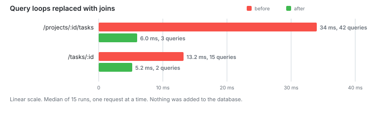

# Stage 4: Removing N+1

Joins and one grouped count instead of query loops.

**Capacity: 120 RPS to 400 RPS.**



## The problem

The task list ran 42 queries for one page. One for the project, one for the tasks,
then two per task inside a loop:

```ts
for (const task of tasks) {
  const assignee = await db.query.users.findFirst(...);
  const [commentCount] = await db.select({ value: count() })...;
}
```

After stage 3 all of those were fast. The main query was 0.178 ms of the 34 ms the
endpoint took. The other 40 round trips were the rest of it.

## The change

The assignee comes from a join now. The counts come from one query that covers all
20 tasks:

```ts
.select({ taskId: schema.comments.taskId, total: count() })
.where(inArray(schema.comments.taskId, taskIds))
.groupBy(schema.comments.taskId)
```

I did the same to `/tasks/:id`. Comment authors arrive with the comments.

## Numbers

| Endpoint            | Queries before | After |
| ------------------- | -------------- | ----- |
| /projects/:id/tasks | 42             | 3     |
| /tasks/:id          | 15             | 2     |

| Endpoint             | Stage 3 | Stage 4 |
| -------------------- | ------- | ------- |
| /tasks/:id           | 13.2 ms | 5.2 ms  |
| /projects/4200/tasks | 34 ms   | 6.0 ms  |
| /projects/1/tasks    | 32 ms   | 5.9 ms  |

Under load:

| Asked for | Task list p95 | Kept up        |
| --------- | ------------- | -------------- |
| 200 RPS   | 13.3 ms       | yes            |
| 400 RPS   | 8.2 ms        | yes            |
| 600 RPS   | 108.9 ms      | no, 94 dropped |

## Notes

A join can make the planner pick a different plan, so I checked that the index
from stage 3 survived:

```
Nested Loop Left Join
  -> Index Scan using tasks_project_created_idx (20 rows)
  -> Index Scan using users_pkey (12 loops)
Execution Time: 3.470 ms
```

This was the cheapest stage in the project. Two rewritten queries. Nothing added
to the database.

400 RPS gave a lower p95 than 200 RPS, 8.2 ms against 13.3. The cache was warmer
on the second run.

Plan: [stage4/join-plan.txt](stage4/join-plan.txt)

## Next

The server uses one core out of six.
