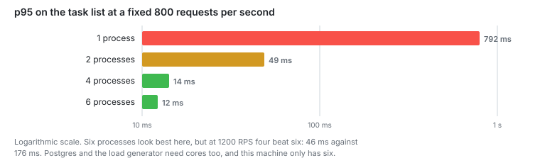

# Stage 5: All cores

Node runs JavaScript in one thread. Started four processes instead of one.

**Capacity: 400 RPS to 1200 RPS.**



## The problem

At 400 RPS the database was idle: 6 of 10 pool connections free, nothing waiting.
Event loop lag said nothing useful, so I measured CPU per process instead.

|             | Cores |
| ----------- | ----- |
| node        | 1.16  |
| k6          | 0.4   |
| machine has | 6     |

One process had saturated its thread with four and a half cores sitting free.

## The change

```ts
if (WORKERS > 1 && cluster.isPrimary) {
  for (let i = 0; i < WORKERS; i++) {
    cluster.fork();
  }
}
```

`WORKERS` lives in `.env`. Every worker listens on the same port and the OS hands
out connections.

## Numbers

p95 on the task list, and requests the generator gave up on:

| Workers | 400 RPS | 800 RPS             | 1200 RPS               |
| ------- | ------- | ------------------- | ---------------------- |
| 1       | 9 ms    | 792 ms, 656 dropped | 1.46 s, 10 082 dropped |
| 2       | 7 ms    | 49 ms, 64 dropped   | 1.02 s, 2511 dropped   |
| 4       | 6 ms    | 14 ms, 120 dropped  | **46 ms, 70 dropped**  |
| 6       | 6 ms    | 12 ms, 0 dropped    | 176 ms, 649 dropped    |

CPU at four workers and 1200 RPS:

| Process    | Cores |
| ---------- | ----- |
| worker 1   | 0.97  |
| worker 2   | 0.77  |
| worker 3   | 0.72  |
| worker 4   | 0.67  |
| node total | 3.13  |
| k6         | 0.86  |

## Notes

Four workers beat six. Six looked better at 800 RPS and lost badly at 1200, 176
ms against 46 ms. Postgres and k6 need cores too, and there are six of them.

The gain is 3x, not 4x. Perfect scaling by process count does not happen when
everything shares a machine.

Work is spread unevenly. The busiest worker took 0.97 cores, the quietest 0.67, a
45 percent spread. On Windows the OS decides and it does not round-robin.

`cluster.SCHED_RR` made things worse. With round-robin the primary holds the
socket and passes every connection to a worker over IPC, so the primary becomes
the bottleneck. Throughput fell as workers were added: 1198, 956, 710, 739 RPS
for 1, 2, 4 and 6 workers. The switch is still in the code behind `SCHED=rr`.

My first attempt at this measurement was worthless. `taskkill` did not kill the
server between runs, so all four runs hit the same single-worker process, and the
numbers looked like adding workers made things slower. The script now checks the
port is free before starting the next one.

The pool is per worker. Four workers with 10 connections each is 40 to Postgres,
which allows 100 by default.

## Next

The server still refuses nothing under overload. It just makes everyone wait.
