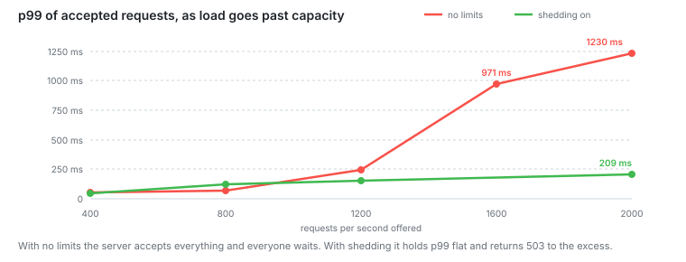

# Stage 6: Under overload

Query timeouts, a pool timeout, and a cap on requests in flight.

**Capacity: still 1200 RPS.** At 2000 asked for, p99 went from 1230 ms to 209 ms.



## The problem

Every stage so far ended the same way. Above capacity the server returned no
errors and made everyone wait. At 2000 asked for, p99 was 1230 ms and k6 gave up
on 27 855 requests. The server was still computing answers nobody was waiting for.

## The change

```ts
new Pool({
  connectionTimeoutMillis: 2000,
  statement_timeout: 3000,
  query_timeout: 3000,
});
```

```ts
if (shedding && inflight.current >= MAX_INFLIGHT) {
  reply.status(503).header('retry-after', '1').send({ error: 'Server overloaded' });
  return;
}
```

`/health` and `/metrics` skip the check. If a monitoring endpoint returned 503
during overload, a load balancer would pull the server out at the worst moment.

## Numbers

Four workers. p99 of the requests the server accepted:

| Asked for | No limits | Shedding, limit 25 |
| --------- | --------- | ------------------ |
| 400       | 54 ms     | 42 ms              |
| 800       | 72 ms     | 123 ms             |
| 1200      | 246 ms    | 153 ms             |
| 1600      | 971 ms    | not measured       |
| 2000      | 1230 ms   | 209 ms             |

What the client gets:

| Asked for | No limits: gave up waiting | Shedding: told to retry |
| --------- | -------------------------- | ----------------------- |
| 400       | 0                          | 0                       |
| 800       | 102                        | 26                      |
| 1200      | 496                        | 3569                    |
| 2000      | 27 855                     | 29 644                  |

Throughput is the same either way. At 2000 asked for, the server accepted 1084 per
second with shedding and 1149 without it.

## The limit is a latency dial

Same 2000 asked for. I only changed the limit:

| Limit per worker | In flight | Accepted | Median | Little's law |
| ---------------- | --------- | -------- | ------ | ------------ |
| 15               | 60        | 1071     | 53 ms  | 56 ms        |
| 25               | 100       | 1084     | 88 ms  | 92 ms        |
| 50               | 200       | 974      | 198 ms | 205 ms       |
| 100              | 400       | 1170     | 319 ms | 342 ms       |

The last column is `L / lambda`. For each row I used the accepted rate from that
same row. Every row lands within 7 percent. The 400 row fits worst, at 7.

## Notes

Capacity did not move. This stage caps latency. That is a different thing from
adding throughput.

Shedding costs something below capacity. At 800 asked for, p99 was 123 ms with the
limit and 72 ms without it. Limit 25 caps how much work runs at once, and at that
rate the machine could handle more.

To pick the limit, take the p99 you want to promise and divide by your throughput.
It is not a number to make as large as possible.

Timeouts on their own changed almost nothing. In a separate run at 2000 asked for,
the server accepted 1025 with them and 1149 without, and p95 stayed at 1460 ms. A
timeout stops one stuck query from holding a connection. It does not shorten a
queue.

The 1600 row has no shedding number. I stopped measuring that rate once the
pattern was clear at 2000.

## Next

The database is idle at capacity and Node is the limit. I need to see what Node
spends its time on.
