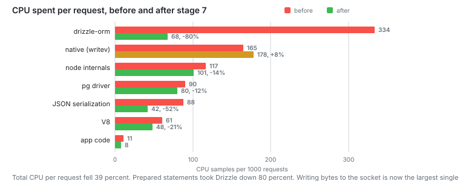

# Stage 7: Cost of abstraction

Prepared statements, response schemas, fewer columns. I did not touch the
database.

**Capacity: 1200 RPS to 2000 RPS.** At 2000 asked for, p99 went from 209 ms to
93 ms.



## The problem

The database was idle at capacity and Node was the limit. So I profiled Node with
`node --cpu-prof` at 700 asked for, on one worker:

|                                        | Self time |
| -------------------------------------- | --------- |
| drizzle-orm                            | 37.0%     |
| native, `writev` is 12.2% of it        | 18.3%     |
| node internals                         | 13.0%     |
| pg, its protocol and its pool          | 9.9%      |
| fastify, JSON serialization 7.9% of it | 9.7%      |
| V8                                     | 6.8%      |
| GC                                     | 2.2%      |
| my code                                | 1.2%      |
| everything else                        | 1.7%      |

Add up Drizzle, native, node, pg and Fastify and you get 87.9 percent. My own code
is 1.2 percent.

The most expensive single function in the server was `is` from Drizzle, at 13.9
percent. It checks types. Drizzle calls it every time it builds a piece of SQL.

## The change

Drizzle built the SQL string again on every request. A prepared statement builds
it once:

```ts
const tasksByProject = db
  .select({ ... })
  .where(eq(schema.tasks.projectId, sql.placeholder('projectId')))
  .prepare('tasks_by_project');
```

The grouped count needed `= ANY($1::bigint[])` instead of `inArray`. `IN (...)`
takes a different number of placeholders every call, so it cannot be prepared.

Without a response schema, Fastify uses `JSON.stringify`. With one it uses
`fast-json-stringify`.

The task list selected every column, including a `text` description that a list
never shows. Now it selects seven.

## Numbers

One worker. The limit after each change:

| Step                | Limit    | Gain |
| ------------------- | -------- | ---- |
| stage 6             | 760 RPS  |      |
| prepared statements | 1080 RPS | +42% |
| response schemas    | 1160 RPS | +7%  |
| fewer columns       | 1270 RPS | +9%  |

Four workers with shedding on, which is the default:

| Asked for | Accepted | Median | p95   | p99    | Shed   |
| --------- | -------- | ------ | ----- | ------ | ------ |
| 2000      | 2033     | 20 ms  | 57 ms | 93 ms  | 3591   |
| 2400      | 2051     | 28 ms  | 64 ms | 107 ms | 12 695 |
| 3000      | 2104     | 39 ms  | 71 ms | 107 ms | 26 180 |

## CPU per request

The two profiles ran at different rates, so I cannot compare their percentages.
Samples per thousand requests I can:

|                    | Before    | After     |          |
| ------------------ | --------- | --------- | -------- |
| drizzle-orm        | 333.6     | 68.2      | -80%     |
| native             | 164.9     | 177.7     | +8%      |
| node internals     | 117.2     | 100.7     | -14%     |
| pg                 | 89.2      | 79.8      | -11%     |
| JSON serialization | 87.4      | 42.4      | -52%     |
| V8                 | 61.3      | 48.4      | -21%     |
| my code            | 10.8      | 8.3       | -24%     |
| **whole process**  | **903.4** | **550.4** | **-39%** |

The rows add up to 866 and 526. The rest is GC, prom-client, pino and the router.
Each of those is under 2 percent.

## Notes

Prepared statements were worth more than the other two changes together. `is` went
from the most expensive function in the server to outside the top ten.

Response schemas cut serialization in half and moved the limit by 7 percent.
Serialization was 10 percent of the work, so 7 percent is what it could give. The
profile showed that before I started.

Fewer columns changed the API. The list response went from 6254 bytes to 3722. So
this one is not free. A list does not need the full description of every task, and
that is why I think the change is fine.

I diffed every change against a saved response. The first two came out identical
byte for byte. The third changed on purpose. Files:
[projects](stage7/golden-projects.json), [task](stage7/golden-task.json)

Prepared statements are slow on the first request. Right after a restart p95 was
455 ms, while every connection in the pool parsed the statements. The second run
showed 19 ms.

`writev` is now the biggest single cost at 22.2 percent, up from 12.2. That is the
kernel copying response bytes into a socket.

Profiles: [before](stage7/profile-700rps.txt), [after](stage7/profile-after.txt),
[per request](stage7/cpu-per-request.txt). The `.cpuprofile` files are in the same
folder and open in Chrome DevTools.

## Next

To go faster I have to stop building those bytes.
