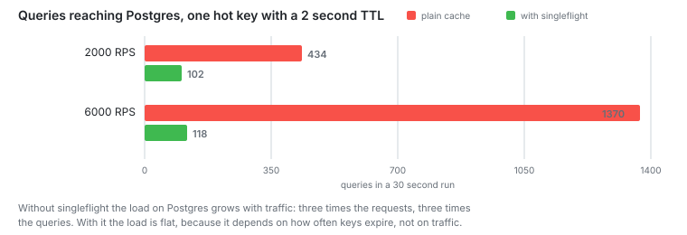

# Stage 8: Redis cache

A cache, invalidation on write, and singleflight.

**Capacity: 2000 RPS to 2600 RPS.** Hit rate 38 percent.



## The problem

After stage 7 the biggest cost was `writev`, the kernel copying bytes into
sockets. Nothing in my code makes that cheaper. I have to not build the response
at all.

## The change

I store the value as a JSON string and send it back without parsing it:

```ts
const payload = await cached(cacheKeys.projectTasks(projectId), async () => {
  return { project, tasks };
});
return reply.type('application/json').send(payload);
```

A hit skips the queries, the row mapping and the serialization. Adding a comment
deletes both keys it affects:

```ts
await invalidate([cacheKeys.task(taskId), cacheKeys.projectTasks(task.projectId)]);
```

## Numbers

Four workers with shedding on. The no-cache row is a fresh run of the stage 7
setup, not the numbers from stage 7. That is why the two files differ a little:

| Variant     | Asked for | Accepted | p95   | p99    | Hit rate |
| ----------- | --------- | -------- | ----- | ------ | -------- |
| no cache    | 2000      | 2117     | 52 ms | 87 ms  |          |
| cache, 30 s | 2000      | 2130     | 40 ms | 65 ms  | 35.8%    |
| cache, 30 s | 3000      | 2631     | 55 ms | 87 ms  | 38.5%    |
| cache, 30 s | 4000      | 2575     | 65 ms | 104 ms | 38.0%    |

## TTL turned out not to matter

All at 3000 asked for:

| TTL   | Accepted | Hit rate |
| ----- | -------- | -------- |
| 30 s  | 2631     | 38.5%    |
| 120 s | 2428     | 37.8%    |
| 600 s | 2318     | 36.9%    |

Twenty times the TTL and the hit rate moved by half a point. What limits it is how
often the same key comes back.

`/tasks/:id` picks from 2 million ids. Even with skewed traffic, two requests
almost never want the same task, so almost all of them miss. A write reads the
task first, so that endpoint is 40 percent of all requests. No TTL fixes that.
`/projects/:id/tasks` picks from 20 000 ids and caches well.

What to cache is a question about how people read the data.

## Cache stampede

A hot key expires. Every request that arrives before the first one finishes goes
to the database. They all compute the same answer.

Singleflight keeps one build per key per process. The rest wait for it:

```ts
const running = inflight.get(key);
if (running) return await running;
```

One key, 2 second TTL, 30 second run. I counted the queries with
`pg_stat_statements`:

| Asked for | Plain cache | Singleflight |
| --------- | ----------- | ------------ |
| 2000      | 434 queries | 102          |
| 6000      | 1370        | 118          |

Three times the traffic gave three times the queries without singleflight. With it
the number barely moved. Database load stopped following traffic and started
following how often keys expire.

Latency at 6000 barely changed, p95 21.9 ms against 22.7. The worst case dropped
from 209 ms to 163.

## Notes

My first stampede test showed nothing. Traffic was spread over thousands of keys,
and a stampede needs one hot key. I wrote a second load script that hits a single
endpoint, and then the effect showed up.

Singleflight works per process. Four workers means up to four builds per key at
the same time. Getting down to one would need Redis to coordinate, and that costs
a round trip on every miss.

On the hot key at 2000 asked for, singleflight raised p99 from 9.0 ms to 14.4 ms.
The worst case dropped from 193 ms to 129 ms. Requests wait for one build instead
of running their own.

Raw strings mean Fastify response schemas do not apply to cached routes. So I
compared cache-off and cache-on responses byte for byte instead. Files:
[projects](stage8/golden-projects.json), [task](stage8/golden-task.json)

Redis runs with `--save "" --appendonly no` and an LRU limit.

`pg_stat_statements` needs `shared_preload_libraries` in the Compose command and a
restart. `CREATE EXTENSION` on its own collects nothing. That cost me ten minutes.

## Next

The misses are 60 percent of traffic. Each one runs two or three prepared queries.
A pooler would let more workers share fewer connections. Caching `/tasks/:id`
under something other than its own id, per project page for example, would move
the hit rate.
